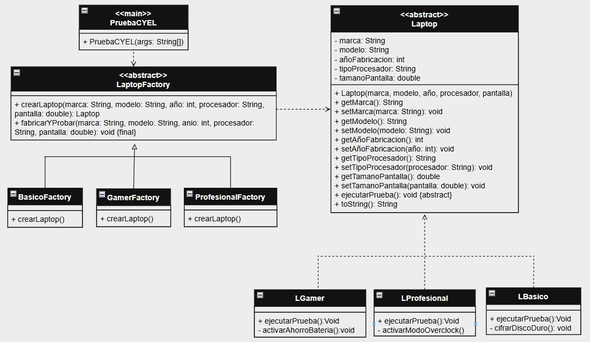

# Laptop Factory - Factory Method Pattern

Este proyecto es una implementación pedagógica del **Patrón de Diseño Factory Method** en Java. El objetivo principal es desacoplar la lógica de creación de objetos de la lógica de uso de los mismos.

## ¿Por qué esta estructura?

La arquitectura del proyecto sigue el principio de **Responsabilidad Única (SRP)** y **Abierto/Cerrado (OCP)**, organizando el código de la siguiente manera:

### 1. Paquete `model` (Productos)
Contiene la jerarquía de los productos.
- **`Laptop`**: Clase abstracta base que define el contrato común para todas las laptops (atributos y comportamiento).
- **Subclases concretas**: Implementan las variaciones específicas de cada producto (`LBasica`, `LGamer`, `LProfesional`).

### 2. Paquete `builder` (Fábrica Abstracta)
Contiene la definición del **Factory Method**.
- **`LaptopFactory`**: Clase abstracta que define el método abstracto `crearLaptop()`. Al ser abstracta, obliga a cualquier fábrica concreta a implementar su propia lógica de instanciación, garantizando que el cliente no dependa de clases concretas.

### 3. Paquete `app` (Fábricas Concretas)
Contiene las implementaciones específicas de las fábricas.
- Cada fábrica (ej. `GamerFactory`) se encarga únicamente de instanciar su producto correspondiente. Esto permite añadir nuevos tipos de laptops en el futuro sin modificar el código existente en `PruebaCYEL`.

### EXTRA: Comportamientos Específicos
si las clases hijas no tienen comportamientos únicos, no tiene sentido que existan por eso en cada clase de `model` se agregaron metodos unicos en cada uno.

## Diagrama de Arquitectura

## Flujo de Trabajo
1. El cliente (`PruebaCYEL`) solicita un objeto a través de una fábrica (`LaptopFactory`).
2. La fábrica instancía el tipo correcto de `Laptop` (basado en el polimorfismo).
3. El cliente trabaja con la interfaz abstracta `Laptop` sin preocuparse por los detalles internos de construcción.

---
*Desarrollado para la asignatura de Arquitectura de Software.*